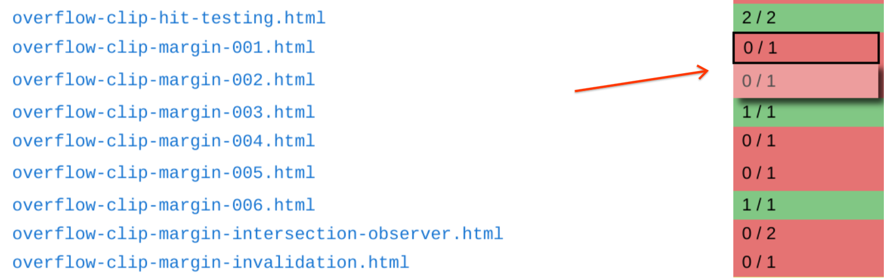
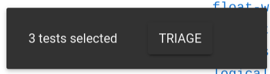
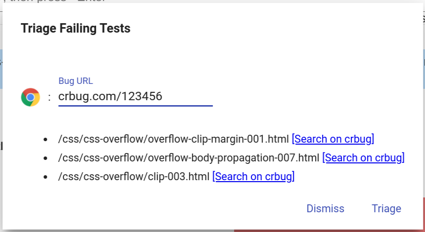

# Triaging failing tests (aka wpt-metadata)

The [wpt.fyi](https://wpt.fyi) dashboard has support for linking test results
for a specific test and browser to issues or bugs (or more generically, any
URL). The triaged data is stored in the
[wpt-metadata](https://github.com/web-platform-tests/wpt-metadata) repository
and is reflected back onto [wpt.fyi](https://wpt.fyi).

This guide explains how to triage failing tests, as well as how to utilize the
triaged information later.

## Pre-requisites

1. You must have a [GitHub](https://www.github.com) account which is a member
   of the [web-platform-tests organization](https://github.com/web-platform-tests).
    * If you are not yet a member, ping smcgruer@ to be added.
2. Visit [wpt.fyi](https://wpt.fyi), and click `Sign in with GitHub` at the
   top-right of the page.

## Triaging failures

[wpt.fyi](https://wpt.fyi) supports triaging tests at a directory-level, a
test-level, or at the subtest level. Triaging at a directory-level implies
triaging all tests within that directory (recursively). Triaging at the
test-level implies triaging all subtests within that test.

To triage one or more tests:

1. Enable triage mode:

2. Select one or more directories/tests/subtests by clicking on the results
   cells. Note that cells with no failures cannot be triaged; if you have a
   use-case for doing so please [file an
   issue](https://github.com/web-platform-tests/wpt.fyi/issues/new)!

3. Click the `TRIAGE` button in the bottom-left corner:

4. A pop-up will appear, which allows you to specify a bug for the failure(s).
   Test result(s) can be triaged to any URL, but are usually triaged to a bug
   from the relevant bug-tracker (e.g. `https://crbug.com/XYZ` for a Chrome
   failure).

   * To aid in finding existing bugs, we provide a pre-filled links for most
     browsers to search their bug trackers for the test being triaged.

5. Click the `Triage` link in the pop-up. The UX will disappear. Shortly you
   should see a popup in the bottom-left with the PR we have created for your
   triaged test(s). There is no need to do anything with that PR - it will be
   automatically merged once the tests pass.

   * It takes a short while (~10min) for the PR to be merged and shown on
     wpt.fyi, so be careful not to triage the same test multiple times.

## Utilizing the triaged data

**TODO: Write this section**
